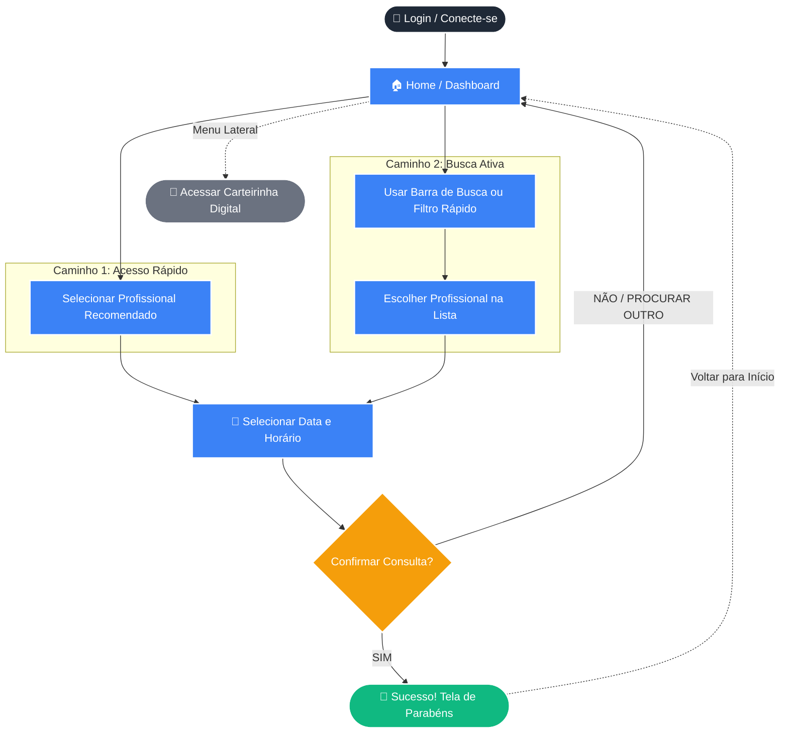

# 🏥 App de Agendamento Clínico - Wireframe Mobile

> **Status do Projeto:** Concluído ✅ | **Data de Entrega:** 17/03/2026

Olá! 👋 Bem-vindo(a) ao repositório do meu projeto de interface mobile. Este wireframe de baixa fidelidade foi desenvolvido como requisito da disciplina Interface e Jornada do Usuário do 2º semestre do curso de **Análise e Desenvolvimento de Sistemas**.

---

## 📌 Sobre a Atividade

- **Valor:** 1,5 pts
- **Semana de Entrega:** Semana 4
- **Avaliação:** Por pares (cada aluno testa e avalia 3 projetos via Forms no dia 18/03)
- **Ferramenta Utilizada:** Figma 🎨
- **Formato:** Wireframe Mobile (Baixa Fidelidade) com fluxo navegável.

---

## 🎯 O Desafio e a Situação-Problema

A situação-problema escolhida envolve a criação de um sistema digital para **facilitar o agendamento de consultas médicas**. O objetivo principal do usuário neste protótipo é conseguir marcar uma consulta com um profissional de saúde de forma rápida e intuitiva, tendo acesso a informações de data, horário e localização.

Além disso, o aplicativo conta com recursos adicionais, como o acesso rápido à **Carteirinha Digital de Acesso** do paciente.

### 🧩 A Tarefa Principal
**Agendar uma consulta médica** com um especialista (ex: Oftalmologista, Cardiologista, Neurologista, etc.).

### 🛣️ Flexibilidade de Uso: Os Dois Caminhos
Para garantir a flexibilidade e atender aos requisitos da atividade, o fluxo foi desenhado permitindo que o usuário chegue ao agendamento de **pelo menos duas formas distintas**:

1. **Caminho 1 (Acesso Rápido):** Acessando a página inicial (Home) e clicando diretamente em um dos **Profissionais Recomendados** (ex: Dr. Albert, Dr. Flavio, etc.), escolhendo a data/hora e confirmando o agendamento.
2. **Caminho 2 (Busca Ativa):** Utilizando a barra de **"Buscar por profissionais"** ou clicando nos botões de filtro rápido (**Médicos, Dentistas, Infantil**) localizados no topo da tela inicial para encontrar um especialista específico antes de prosseguir com a seleção de horário.

---

## 📱 Telas e Arquitetura da Informação

O fluxo foi estruturado para ser simples e direto, garantindo clareza funcional. As principais telas desenvolvidas foram:

- 🔐 **Login / Conecte-se:** Tela de entrada com opções de login por e-mail, senha ou redes sociais (Google, Apple, Facebook).
- 🏠 **Home (Dashboard):** Saudação ao usuário ("Olá, Talisom"), barra de pesquisa, filtros de especialidade e lista de cards de médicos com avaliações.
- 📅 **Seleção de Data e Hora:** Calendário interativo (Março 2026) e grade de horários disponíveis do profissional escolhido.
- ❓ **Confirmação de Ação:** Pop-up/Tela de validação questionando se o usuário deseja confirmar o agendamento (Sim / Não) ou procurar outro profissional.
- 🎉 **Tela de Sucesso:** Mensagem de "PARABÉNS" confirmando que a consulta foi agendada.
- 🪪 **Menu e Carteirinha de Acesso:** Menu lateral que dá acesso aos dados do paciente, incluindo QRCode, validade e status do plano/cartão.

---
## 🗺️ Fluxo de Interação do Usuário (Jornada)

Para facilitar o entendimento da arquitetura da informação e da flexibilidade do aplicativo, o diagrama abaixo ilustra os **dois caminhos possíveis** que o usuário pode percorrer para concluir sua tarefa principal (agendar a consulta), além das interações secundárias.

---

## 🔗 Link do Protótipo

Teste o fluxo navegável e interativo diretamente no Figma clicando no link abaixo:

👉 **[CLIQUE AQUI PARA ACESSAR O PROTÓTIPO NO FIGMA](https://www.figma.com/proto/ezQ526J9BFAP2FbqT2o6i3/trablho-dia-17?node-id=0-1&t=AsdCiYzYTiIxeflh-1)**

---

## ✅ Rubricas de Avaliação Atendidas

Neste projeto, busquei contemplar todos os critérios exigidos pelo professor:

- [x] **Estrutura da interface:** Layout mobile organizado e responsivo para baixa fidelidade.
- [x] **Clareza funcional:** Botões, ícones e textos deixam claro o que cada ação faz.
- [x] **Flexibilidade de uso:** Múltiplos caminhos mapeados para o mesmo objetivo final.
- [x] **Coerência com o problema:** Solução foca estritamente em resolver a dor do agendamento médico.
- [x] **Qualidade do protótipo:** Telas conectadas criando uma jornada de uso realista (Login -> Busca -> Agendamento -> Confirmação).

---

## 👥 Autoria

Desenvolvido por:
- **Ector Carvalho** - Estudante de Análise e Desenvolvimento de Sistemas (2º Semestre).
- **Leonardo Teles** - Estudante de Análise e Desenvolvimento de Sistemas (2º Semestre).
- **Talisom Santos** - Estudante de Análise e Desenvolvimento de Sistemas (2º Semestre).
